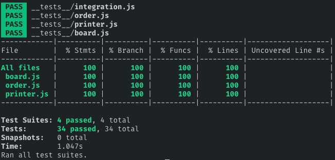

[](https://travis-ci.org/jonurry/snakes-and-ladders-kata)
[](https://codecov.io/gh/jonurry/SilverBars-Marketplace)

# Silver Bars Marketplace

## Overview

This is a tech test for a Makers hiring partner to see how much demand for silver bars there is on the market.

I knew that I wanted to test-drive my solution so following a `test-driven development` approach was essential. I used the `red, green, refactor` TDD approach where you write a failing test, implement code to pass the test and then refactor to keep the code clean and as simple as possible.

I retained the domain language of the original requirements when naming classes. I strived for a simple, clean and high-quality solution.

- Preferring the simplest implementation rather than introducing unneeded complexity.

- Refactoring regularly to eliminate duplication and produce clean code.

- Aiming for a high-quality solution by catering for edge cases, using design patterns where appropriate, decoupling code to improve maintainability and testability, encapsulating code to hide implementation details and ensuring that classes had a single responsibility.

## Design Decisions and Assumptions

- **`Order`** - The Order class stores the attributes of a single BUY or SELL order

  - **`userId`** - I decided that this should be a whole number for simplicity

  - **`quantity`** - a positive number that can be formatted to 1 decimal place

  - **`price`** (per kg) - assumed a whole number that can be formatted as Sterling

  - **`type`** - a string with 'BUY' or 'SELL' values only. I did consider using an enum (object) but a string is simpler

  - I also considered adding a boolean **`cancelled`** attribute (see below) to keep the order but exclude it from the summary, and a unique **`orderId`** number to identify an order e.g. for cancellation. I didn't implement either of these to keep the solution simpler.

- **`Cancel an Order`** - I decided to just remove the Order from the storage array at this point as it is the simplest implementation that satisfies the requirements. Each Order is identified by its position in the array. I would switch to using a unique `orderId` if developing the solution further because this makes it easier to identify an Order but is slightly more complex to implement.

- **`Order Summary`** - It wasn't clear from the requirements whether there are separate boards for BUY and SELL orders or whether they are combined. I decided to combine them and list BUY Orders first, then SELL Orders. The processing of BUY and SELL Orders is separated so it would be easy to list Orders on separate boards if required.

I used dependency injection to decouple code and make it easier to test. A factory method is injected into the Board so that Orders can be created without knowing the implementation details or having tightly-coupled dependencies. The Printer class is injected so that different output methods can be used and also to improve testability and keep to the single responsibility principle.

The `Board` exposes the `_order` storage array but names it with an underscore to denote privacy. I considered using class fields but that requires Babel to transpile the new ES10 feature. Again, I kept it simple.

I used pure functions so that parameter values are not altered by functions. Either arrays are copied, or, the first transformation creates a new array in order to preserve the original value(s).

I made use of `mocks` for testing so that each class could be tested in isolation from its dependencies.

I used Unix line feed (LF) characters when outputting the summary. This may not work on Windows where the use of CRLF is standard.

## Technologies Used

- `JavaScript` - I like JavaScript and it's one of the languages taught at Makers. It is also used by the hiring partner so it seemed like a natural fit.

- `node.js` - A standalone javascript runtime environment so that the code doesn't have to run in a browser.

- `jest` - Testing framework. It's really powerful and I like using it.

- `ESLint` - For linting javascript syntax and ensuring that the code conforms to accepted style guidelines.

- `babel` for transpiling the ES6+ JavaScript code to ES5 so that `node` and `jest` understands it.

- `Travis` - A continuous integration (CI) build server in the cloud that monitors the master branch of the code repository in GitHub and builds the code on every commit and runs all tests. The build status badge is at the top of this README.

- `Test Coverage` - All tests can be run with code coverage enabled. Data is gathered that measures how much of the code is tested. The stats can be viewed at [codecov.io](https://codecov.io/gh/jonurry/SilverBars-Marketplace) or in the terminal when running the tests locally.

- I also use `Prettier` in the `VS Code` IDE to ensure consistent code formatting

## Installation

The project requires `Node.js` to be installed on your computer. If you don't have node installed you can download and install it by following the instructions located [here](https://nodejs.org/en/download/)

To get the project code, please enter the following command in the terminal:

```
git clone git@github.com:jonurry/SilverBars-Marketplace.git
```

then, change to the newly created code directory:

```
cd SilverBars-Marketplace
```

To install the project dependencies, please enter the following command in the terminal:

```
npm install
```

## Tests

To run all of the tests with code coverage (only once), please enter the following command in the terminal:

```
npm t
```

or

```
npm test
```

or

```
npm run test:c
```



To run tests in verbose mode (to see individual test results):

```
npm run test:v
```


To run the tests in watch mode:

```
npm run test:w
```


If you want to run all tests in watch mode with full test coverage and verbose results:

```
npm run test:a
```

## User Stories

```
As an investor,
I would like to register an order
so that I can buy or sell silver bars
```

```
As an investor,
I would like to cancel an order
so that I can change my mind about buying or selling silver bars
```

```
As an investor,
I would like to see how much demand for silver bars there is on the market
so that I can judge the best time to buy or sell silver bars
```

```
As an investor,
I would like orders to be grouped by price
so that I can get an overall sense of current buying and selling trends
```

```
As an investor,
I would like BUY orders to be shown in descending price order
so that I can see the highest price that other investors are willing to pay first (I can then try to get the best price when selling my silver bars)
```

```
As an investor,
I would like SELL orders to be shown in ascending price order
so that I can see the lowest price that other investors are selling silver bars for first (in order that I can try to buy silver bars at the lowest market price)
```

## Requirements

Imagine you're working as a programmer for a company called SilverBars Marketplace and you have just received a
new requirement. In it we would like to display to our users how much demand for silver bars there is on the market.

To do this we would like to have a 'Live Order Board' that can provide us with the following functionality:

1. Register an order. Order must contain these fields:

   - user id
   - order quantity (e.g.: 3.5 kg)
   - price per kg (e.g.: £303)
   - order type: BUY or SELL

2. Cancel a registered order - this will remove the order from 'Live Order Board'

3. Get summary information of live orders (see explanation below). Imagine we have received the following orders:
   - a) SELL: 3.5 kg for £306 [user1]
   - b) SELL: 1.2 kg for £310 [user2]
   - c) SELL: 1.5 kg for £307 [user3]
   - d) SELL: 2.0 kg for £306 [user4]

Our ‘Live Order Board’ should provide the following summary information:

- 5.5 kg for £306 // order a + order d
- 1.5 kg for £307 // order c
- 1.2 kg for £310 // order b

The first thing to note here is that orders for the same price should be merged together (even when they are from
different users). In this case, it can be seen that order a) and d) were for the same amount (£306) and this is why
only their sum (5.5 kg) is displayed (for £306) and not the individual orders (3.5 kg and 2.0 kg). The last thing to
note is that for SELL orders the orders with lowest prices are displayed first. The opposite is true for the BUY orders.

Notes:

- Please provide a simple implementation of the live order board in any software language
- The solution should have some instructions on how to demonstrate its functionality/correctness
- No database, UI/WEB or a standalone runnable is needed for this assignment
- Please upload it on GitHub or BitBucket and make it available for us to pull
- If during your implementation you'll find that something could be designed in multiple different ways, just
  implement the one which seems most reasonable to you and if you could provide a short (once sentence)
  reasoning why you choose this way and not another one, it would be great.
